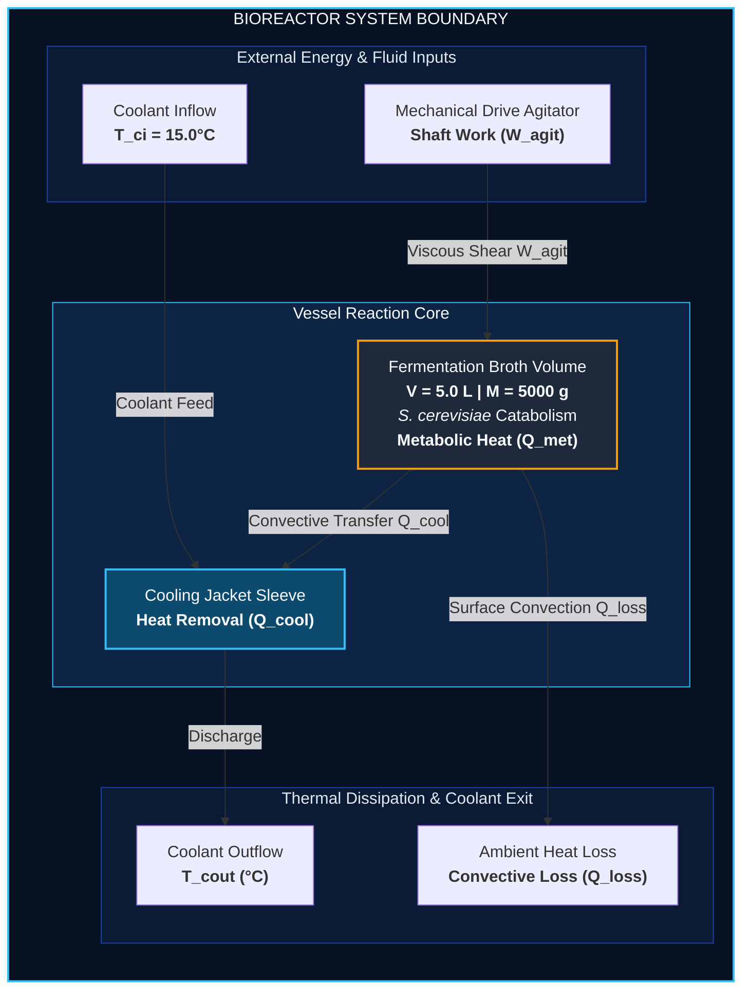
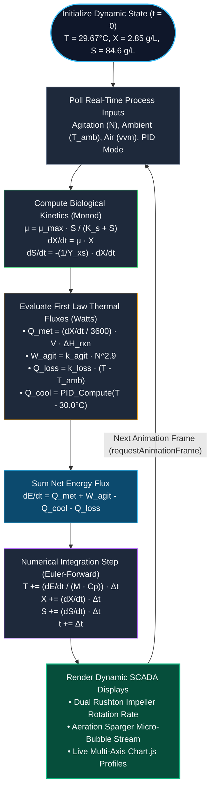

# Stirred-Tank Bioreactor Energy Balance Simulation

**Anaerobic Ethanol Fermentation (_Saccharomyces cerevisiae_) | First Law Dynamic Model**

---

### **Project Metadata & Team Details**

- **PROJECT**: THERMODYNAMICS B.TECH BT GROUP 6 MICROPROJECT
- **PROGRAM**: B.TECH in BIOTECHNOLOGY
- **BATCH**: 2025–2029
- **SEMESTER**: SEM - 03
- **COURSE**: THERMODYNAMICS FOR BIOLOGICAL SYSTEMS
- **COURSE FACULTY**: DR. RADHIKA CHANDANKERE
- **INSTITUTION**: ALLIANCE UNIVERSITY

#### **MADE BY GROUP 6:**

1. **Ayush Raj**
2. **Sourav Pal**
3. **Gourav Paul**
4. **Tuhin Ghosh**
5. **RN Ayush**

**Live Interactive Simulation**: [https://ayushrkamal-dev.github.io/bioreactor-simulation/](https://ayushrkamal-dev.github.io/bioreactor-simulation/)

---

## 1. Executive Summary & Problem Formulation

In industrial biotechnology, temperature regulation inside stirred-tank bioreactors is vital for cell viability, enzyme stability, and maximum product yield. Biological reactions are intrinsically exothermic, and mechanical agitation constantly converts electrical power into viscous heat. Without controlled heat dissipation, thermal accumulation will denature cellular proteins and cease fermentation.

This project delivers a real-time SCADA simulation representing a 5.0 L stirred-tank reactor cultivating _Saccharomyces cerevisiae_ under anaerobic conditions. The software dynamic model solves the non-steady-state **First Law of Thermodynamics** simultaneously with **Monod microbial growth kinetics** and a **closed-loop feedback PID cooling loop**.

---

## 2. Conceptual System Boundary Diagram


---

## 3. Thermodynamics & Biological Kinetics Core

### 3.1 First Law Transient Energy Balance

By applying the First Law of Thermodynamics to a closed liquid control volume of constant mass ($M = V \cdot \rho$):

$$\frac{dE_{\text{system}}}{dt} = \dot{Q}_{\text{net}} - \dot{W}_{\text{net}}$$

Expressed in thermal flux terms (Watts or $\text{J}\cdot\text{s}^{-1}$):

$$\frac{dE}{dt} = Q_{\text{met}} + W_{\text{agit}} - Q_{\text{cool}} - Q_{\text{loss}}$$

The transient rate of temperature change of the liquid broth ($dT/dt$) is governed by:

$$\frac{dT}{dt} = \frac{Q_{\text{met}} + W_{\text{agit}} - Q_{\text{cool}} - Q_{\text{loss}}}{M_{\text{broth}} \cdot C_{p,\text{broth}}}$$

Where:

- $V = 5.0\text{ L}$ (Working Volume)
- $\rho = 1000\text{ g/L}$ (Broth Density)
- $M_{\text{broth}} = V \cdot \rho = 5000\text{ g}$
- $C_{p,\text{broth}} = 4.184\text{ J}/(\text{g}\cdot\text{K})$ (Specific heat capacity of aqueous media)

---

### 3.2 Metabolic Heat Generation ($Q_{\text{met}}$)

Biomass accumulation follows Monod substrate-limited growth kinetics:

$$\mu = \mu_{\max} \frac{S}{K_s + S}$$

$$\frac{dX}{dt} = \mu X, \quad \frac{dS}{dt} = -\frac{1}{Y_{X/S}} \frac{dX}{dt}$$

Metabolic heat released by anaerobic glycolysis and cellular maintenance is directly proportional to biomass synthesis:

$$Q_{\text{met}} = \left(\frac{1}{3600} \cdot \frac{dX}{dt}\right) \cdot V \cdot \Delta H_{\text{rxn}}$$

- Maximum specific growth rate ($\mu_{\max}$): $0.38\text{ h}^{-1}$
- Monod constant ($K_s$): $1.25\text{ g/L}$
- Biomass yield coefficient on glucose ($Y_{X/S}$): $0.51\text{ g cells / g glucose}$
- Exothermic heat of reaction ($\Delta H_{\text{rxn}}$): $14{,}500\text{ J/g biomass produced}$

---

### 3.3 Mechanical Agitation Power Dissipation ($W_{\text{agit}}$)

Rotational shaft work from the dual Rushton turbines dissipates entirely as thermal friction within the turbulent regime:

$$P = N_p \cdot \rho \cdot N^3 \cdot D_i^5 \implies W_{\text{agit}} \approx k_{\text{agit}} \cdot N^{2.9}$$

- Impeller speed range ($N$): $0 - 600\text{ RPM}$
- Empirical power dissipation coefficient ($k_{\text{agit}}$): $2.4 \times 10^{-6}$

---

### 3.4 External Heat Transfer Terms

- **Environmental Heat Loss ($Q_{\text{loss}}$)**:
  $$Q_{\text{loss}} = k_{\text{loss}} \cdot (T_{\text{broth}} - T_{\text{amb}})$$
  Where $k_{\text{loss}} = 1.95\text{ W/K}$ and $T_{\text{amb}}$ is the room temperature.

- **PID-Controlled Jacket Cooling ($Q_{\text{cool}}$)**:
  Targeting an optimal fermentation setpoint of $T_{\text{set}} = 30.0^\circ\text{C}$ with inlet coolant at $T_{\text{ci}} = 15.0^\circ\text{C}$:
  $$e(t) = T_{\text{broth}} - T_{\text{set}}$$
  $$Q_{\text{demand}} = K_p \, e(t) + K_i \int_0^t e(\tau)\,d\tau$$
  $$Q_{\text{cool}} = \min\left(Q_{\text{demand}}, \; U A (T_{\text{broth}} - T_{\text{ci}})\right)$$

- **Coolant Exit Temperature ($T_{\text{cout}}$)**:
  $$T_{\text{cout}} = T_{\text{ci}} + \frac{Q_{\text{cool}}}{\dot{m}_c \cdot C_{p,c}}$$

---

## 4. Simulation Execution Logic & Data Flow


---

## 5. How to Run Locally

### Prerequisites

- Any modern web browser (Safari, Chrome, Firefox, Edge).
- Visual Studio Code.

### Step-by-Step Instructions

1. **Clone the repository**:
   ```bash
   git clone [https://github.com/ayushrkamal-dev/bioreactor-simulation.git](https://github.com/ayushrkamal-dev/bioreactor-simulation.git)
   cd bioreactor-simulation
   ```
